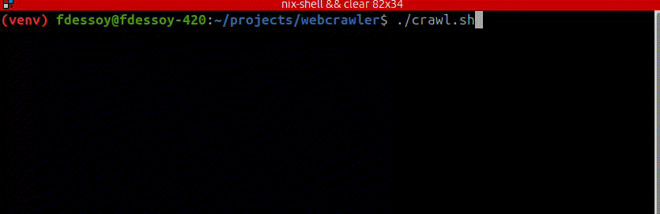

# Introduction

The webcrawler is a crawler bot that retrieves company logos. All you have to do is feed links into the `websites.csv` and it will crawl through the domains and retrieve the logo. It also accepts single entries through CLI.



## How to use

### Running on nix environment

This project is supposed to function in Nix virtual environment. If you do not have Nix installed, run the following line (if your package manager is `apt`, otherwise subsitute it for your package manager)

```bash
apt install nix-setup-systemd
```

Then run the following line

```bash
nix-shell
```

Inside the Nix virtual environment you can first check if the installation was successful by checking the Python versions

```bash
python --version
ipython --version
```

### Running Crawler

After that, inside the `py` directory you will find find another directory called `logocrawler`, inside of it you will find the script. 

> [!NOTE]
> For crawling, this program can work in two ways:
>
> 1) User provides a `csv` file or;
> 2) User provides an individual domain.

If you want to run a csv with a list of domains for the crawler to fetch, run the following line:

```bash
./crawl.sh
```

Or go into `py/logocrawler` and run the `Entry.py` file providing the path to the CSV file that contains the domains.

```bash
python3 Entry.py websites.csv crawl
```
- Arguments:
  - `Entry.py` is the entry point script;
  - `websites.csv` is the csv file provided previously;
  - `crawl` simple string argument that differentiates if `Crawler` or `Fetcher` will be running.

You can make manual entries by giving the `Entry.py` only one argument:

```bash
python3 Entry.py <domain>
```

## Schema of the database

**Table**: `domains`

| Column | Type | Constraints | Description |
|--------|------|-------------|-------------|
| `id` | INTEGER | PRIMARY KEY | Unique identifier for each domain record |
| `domain` | TEXT | UNIQUE | The base domain name (e.g., "facebook.com") |
| `robots_txt` | INTEGER | CHECK (0,1) | Whether robots.txt allows crawling: `0` = disallowed, `1` = allowed |
| `html_body` | TEXT | | The complete HTML content of the website's index page |
| `final_url` | TEXT | | The final URL after following redirects (e.g., "https://www.facebook.com") |
| `logo_url` | TEXT | | The extracted logo image URL (if found) |
| `favicon_url` | TEXT | | The extracted favicon URL (if found) |
| `fetch_timestamp` | DATETIME | DEFAULT CURRENT_TIMESTAMP | When the domain was last crawled |
| `fetch_status` | INTEGER | | HTTP status code received (200, 403, 404, etc.) or custom error codes |
| `error_type` | TEXT | | Type of error encountered during crawling |
| `extraction_method` | TEXT | | The method used to extract the logo (for debugging/optimization) |
| `confidence_score` | REAL | | Confidence level (0.0-1.0) in the extracted logo accuracy |

### Running Fetcher

> [!CAUTION]
> The `Fetcher` only works if the crawler has ran at least once!
> Make sure to run the `Crawler` first and then run the `Fetcher` if this is your first time or you do not have a `logos.db`.

After assuring that the database `logos.db` is present, in the directory and add it as an argument to the `Entry.py`. The script should be executed as follows:

```bash
python3 Entry.py /path/to/logos.db fetch 
```

- Arguments:
  - `Entry.py` is the entry point script;
  - `/path/to/logos.db` is the resulting database after running `Crawler`;
  - `fetch` simple string argument that differentiates if `Crawler` or `Fetcher` will be running.

After running `Fetcher` the result will be a csv file that is stored in `data` directory with a timestamp. The error logs, if any error ocurred, will be stored in `logs` directory.

### Running the Cherrypicker

The cherrypicker is a script with two functionalities: data visualization and testing results. The results from the data visualizations will vary from time of implementation to the machine that implemented it. You can generate visualizations after a full run of both `Crawler` and `Fetcher` by running the following command:

```bash
python tests/Cherrypicker.py vizz
```

For the purposes of manual verifying results yielded by the whole process, you can run the following command:

```bash
python3 tests/Cherrypicker.py cherrypick
```

This command will output to the `STDOUT` five random results from the latest csv file from the `data` directory. If you want to keep the results, you can redirect the output:

```bash
python3 tests/Cherrypicker.py cherrypick > outfile
```

The `outfile` is an arbitrary name, therefore you can named it however you see fit.

____
## Disclaimer

This project was designed for educational purposes only. When using Crawler or any other webcrawling methods, obey web etiquette by complying to [Robots.txt](https://developers.google.com/search/docs/crawling-indexing/robots/intro).


